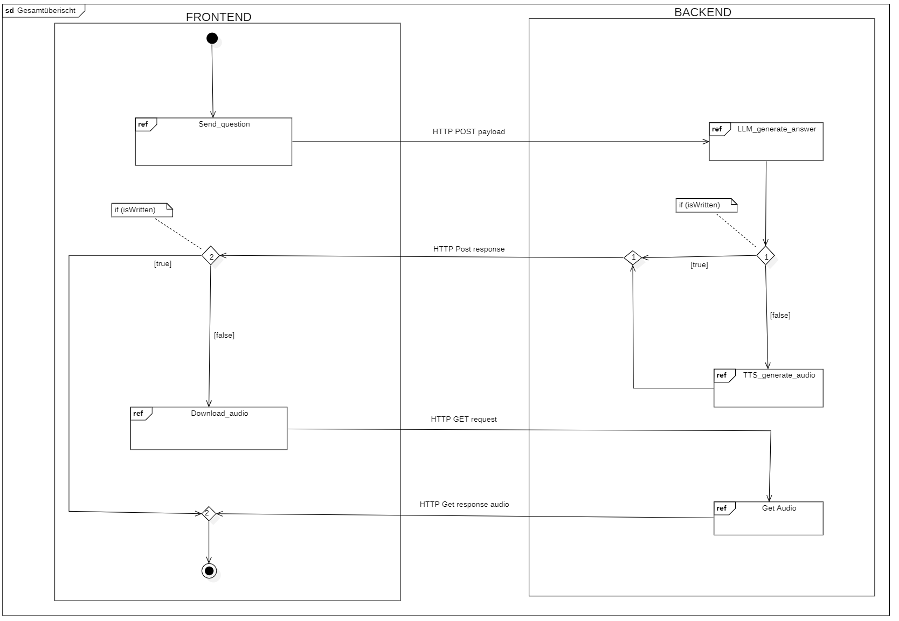

<h1 align="center">
    
    </br> </br>
    <b>GreenAssistant</b>
    </br>
</h1>
<h2>

# Inhalt

## GreenAssistant
Der Chatbot "GreenAssistant" gibt praktische Tipps für einen nachhaltigeren Alltag und vermittelt dabei die spezifischen Nachhaltigkeitsziele Augsburgs. Mithilfe modernster KI-Technologien werden Nutzerfragen individuell und präzise beantwortet. Dieses innovative Open-Source-Projekt macht nachhaltiges Handeln für alle zugänglich.

## Referenzen

* [Projekt Website](https://showcase.informatik.tha.de/sose-2024/greenassistant)

## Open-Source Lizenz
- [LIZENZ DATEI](LICENSE)
- Wir freuen uns über die Nennung der Originalautoren beim Kopieren, Verwenden oder Umschreiben des Quellcodes.

## Feedback
- Kommentare, Fragen und allgemeines Feedback können gerne an folgende E-Mail-Adresse gesendet werden: anja.metzner@hs-augsburg.de

## Mitwirkende

- Bei dem Projekt handelte es sich initial um ein studiengangsübergreifendes Semesterprojekt an der Technischen Hochschule Augsburg.

### **Mitwirkende im Sommersemester 2024:**

- **Studenten/Studentinnen:** Marc Fischer, Manuel Hagen, Lukas Konietzka, Theresa Mayer, Dominik Wagner, Stephan Schorer, Kim Yen Pham, Markus Riffel, Lara Gerlach, Trang Nguyen

- **Beteiligte:** Büro f. Nachhaltigkeit der Stadt Augsburg<br>

- **Supervision:** Prof. Dr. Anja Metzner (Technische Hochschule Augsburg)<br>

Vielen Dank an alle Beteiligten!

<br>


# Quickstart für Entwickler
### Um mit dem Entwickeln zu beginnen, bitte folgende Befehle beachten und ausführen
---
#### Tools installieren:
1.  **Als Erstes müssen die nötigen Tools installiert werden:**
 - python → <https://www.python.org/downloads/>
 - node.js → <https://nodejs.org/en/download/>
---
#### Repository klonen:
2.  **An eine beliebige Stelle navigieren und das Repository über den Button *Code* per *ssh* oder *https* klonen mit:**
 - vpn zur Hochschule nötig
 ````
 git clone [repo]
 ````
 Wenn kein *git* installiert ist, dann hier einmal herunterladen und installieren: <https://git-scm.com/downloads>
---
#### Backend initialisieren:
3.  **Aufsetzen eines virtuellen Environments für Python (kein muss, aber macht Sinn):**
 -  **Tool für Virtuelle Environments installieren (ist aber auch schon im requirements.txt):**
 ````
 pip install virtualenv
 ````
 -  **In den Prokjektordner wechseln!**
 -  **Virtuelles Environment erstellen (env ist der Name des neuen environments, kann auch venv genannt werden):**
 ````
 virtualenv **env**
 ````
 Dies erstellt einen neuen Ordner env/ im Projekt (nicht ins repo pushen, dieser wird von git ignoriert!).
 -  **Virtuelles Environment aktivieren:**
 ````
 source env/Scripts/activate
 ````
 Auf der Commandline erscheint jetzt ein zusätzlicher Prompt, inetwa so: (env) name@PC
 -  **Um das Environment wieder zu deaktivieren:**
 ````
 ~ deactivate
 ````
4.  **In den Ordner *backend* wechseln und alle packages installieren mit:**
 ````
 cd backend
 pip install -r requirements.txt
 pip install TTS
 ````
 Mit diesem Befehl werden alle Packages installiert, die in dem File *requirements.txt* angegeben sind
 > **_Achtung:_** Das Paket TTS ist ganz bewusst nicht im requirements-File, da es ein sehr große Paket ist (10GB).
 Es muss deshalb separat mit dem *pip*-Befehl installiert werden. Für das Packet ist eine Installation von
 Visual Studio nötig. Hier einfach über den Installer das Tool für die Desktopentwicklung installieren und dann den
 *pip*-Befehl für das TSS-Paket ausführen.
 https://visualstudio.microsoft.com/de/downloads/
 
 Sofern dies gegeben ist, kann auch die alternative requirements_full_deployment.txt verwendet werden, dort sind alle optinalen Packete ebenfalls enthalten.
 ````
 cd backend
 pip install -r requirements_full_deployment.txt
 ````
 
5.  **Die Datenbank migrieren mit:**
 ````
 python manage.py migrate
 ````
---
#### Frontend initialisieren:
6.  **Dann in den Ordner *frontend* wechseln und alle Packages installieren mit:**
 ````
 cd frontend
 npm install
 ````
---
#### Einstellung anpassen:
7.  **Frontend und Backend enthalten jeweils Beispielkonfigurationen, welche auf das eigene Umfeld und Hostingvarianten angepasst werden müssen!**

 /frontend/src/axios.ts
 ````
 const baseURL = 'https://greenassistant.ai.tha.de:7000'
 ````

 /backend/crud/settings.py
 ```` 
 DEBUG = False
 
 ALLOWED_HOSTS = [
    'greenassistant.ai.tha.de',
    '141.82.1.31',
 ]
 	
 SECURE_SSL_REDIRECT = True
 
 CORS_ALLOWED_ORIGINS = [
    'http://localhost:3000',
    'https://greenassistant.ai.tha.de',
 ]
 	
 CSRF_TRUSTED_ORIGINS = [
    'https://greenassistant.ai.tha.de',
    'https://greenassistant.ai.tha.de:7000',
 ]
```` 
---
#### Applikation starten:
8.  **Dann eine Zweite Konsole öffnen**
 -  **Auf der ersten wechseln wir in den *frontend* Ordner und starten den Frontend-Server:**
 ````
 cd frontend
 npm start
 ````
 Das Starten des Servers sollte dazu führen, das im Browser eine Website aufgeht
 -  **Auf der anderen Konsole wechseln wir in den *backend* Ordner und starten den Backend-Server:**
 ````
 cd backend
 python manage.py runserver
 ````
 Für den produktiv Betrieb sollte nicht der Entwicklungsserver von Django verwendet werden. Deshalb ist in der requirements.txt ebenfalls gunicorn enthalten, worüber der Server für den besagten Live Betrieb gestartet werden kann.
 ````
 cd backend
 gunicorn crud.wsgi --timeout 120
 ````
9.  **Laufen beide Server ohne Probleme, so kann die Anwendung verwendet und modifiziert werden**
 - Hier einfach mal ausprobieren, ob man Daten zwischen Frontend und Backend verschicken kann.
---
#### Requirements-File aktualisieren:
10.  **Wurden während der Entwicklung neue Packages installiert, muss die *requirements.txt* aktualisiert werden.
 Hierzu einfach folgenden befehle im Ordner *backend* ausführen:**
 ````
 cd backend
 pip freeze > requirements.txt
 ````
 Es werden jedoch nur Module aufgelistet, die via *pip* installiert wurden.

## Softwarestruktur
<h1 align="center">
     </br>
</h1>

